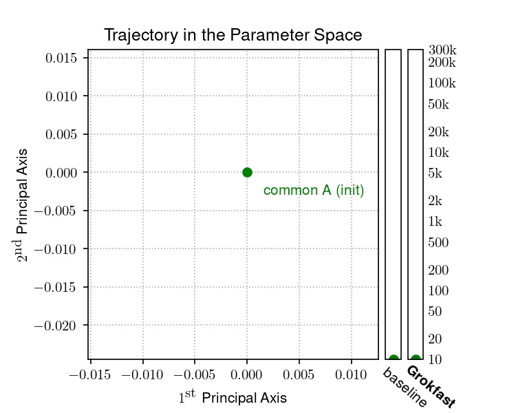
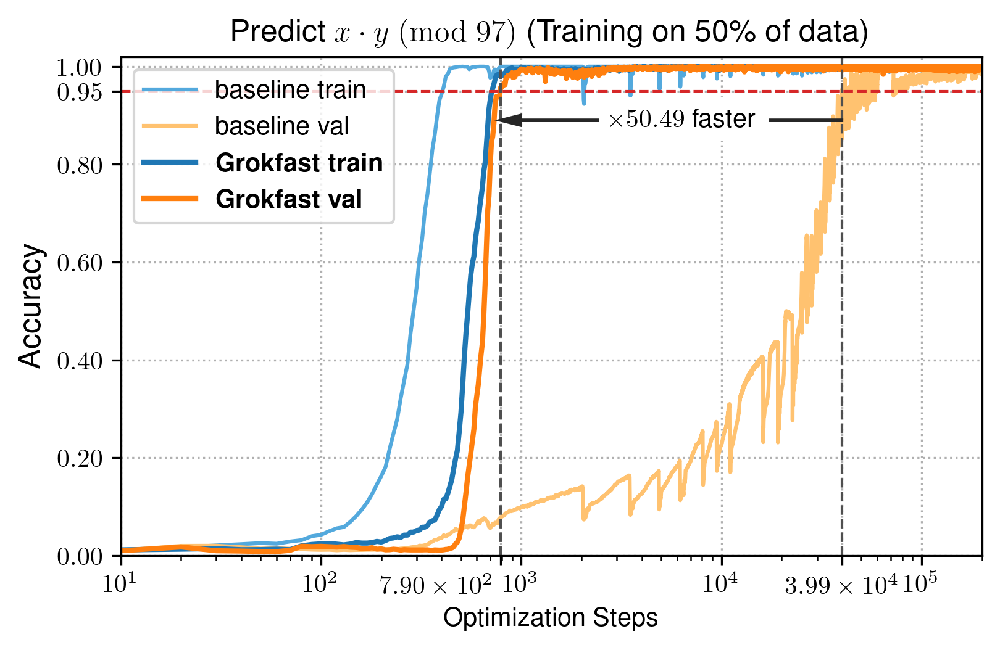

## What's this repo about:
Here we:
1. try out the Grokfast algorithm on more setups that weren't covered in the original paper, such as different parameters, different filters, and its synergistic effects with different optimizers such as AdamW. 
2. experiments for faster kernel-escaping algorithms.

### Usage:
There are many configs in the scripts that start with "test", modify the last few lines of that file to pick a config (a set of experiments) or add new configs/expriments, then run (e.g.)
```python
python test_mlp.py
```
or 
```python
python test_mlp_LoRA.py
```

### Support the work by running different experiments on a different task other than modular arithmetic, if you have enough computing power!

Many aspects are still unknown such as:
- How to find the best parameters for MA and EMA filters, given a specific task. 
- Do other filters such as Kalman filters mitigate grokking as well?
- AdamW with a large weight decay is known to reduce grokking, compare it with Grokfast.


Below is the original readme file.

<div align="center">

<h1>Grokfast: Accelerated Grokking by</br>Amplifying Slow Gradients</h1>

[**Jaerin Lee**](http://jaerinlee.com/)\* · [**Bong Gyun Kang**](https://scholar.google.com/citations?hl=en&user=iuMRdnIAAAAJ)\* · [**Kihoon Kim**](https://github.com/kihoon96/) · [**Kyoung Mu Lee**](https://cv.snu.ac.kr/index.php/~kmlee/)

<h5 align="center">Seoul National University</h5>

<p align="left">
*Denotes equal contribution.
</p>


[](https://jaerinlee.com/research/grokfast)
[](https://arxiv.org/abs/2405.20233)
[](https://github.com/ironjr/grokfast)
[](https://twitter.com/_ironjr_)
[](https://huggingface.co/papers/2405.20233)
[](https://github.com/ironjr/grokfast/blob/main/LICENSE)

</div>

**tl;dr:** We accelerate the [grokking phenomenon](https://arxiv.org/abs/2201.02177) by amplifying low-frequencies of the parameter gradients with an augmented optimizer.

 |    |
:----------------------------: | :----------------------------: |

**Abstract:** 
One puzzling artifact in machine learning dubbed *grokking* is where delayed generalization is achieved tenfolds of iterations after near perfect overfitting to the training data.
Focusing on the long delay itself on behalf of machine learning practitioners, our goal is to accelerate generalization of a model under grokking phenomenon.
By regarding a series of gradients of a parameter over training iterations as a random signal over time, we can spectrally decompose the parameter trajectories under gradient descent into two components: the fast-varying, overfitting-yielding component and the slow-varying, generalization-inducing component.
This analysis allows us to accelerate the grokking phenomenon more than $\times$ 50 with only a few lines of code that amplifies the slow-varying components of gradients.
The experiments show that our algorithm applies to diverse tasks involving images, languages, and graphs, enabling practical availability of this peculiar artifact of sudden generalization.

 |    |
:----------------------------: | :----------------------------: |

---

## Usage

### Installation

Grokfast doesn't require additional packages except for [PyTorch](https://pytorch.org/get-started/locally/). The file `requirements.txt` is only for reproduction of the experiments in the article, as described in the [Reproduction](#reproduction) section below.

### Instructions

Grokfast can be applied by inserting a single line before the optimizer call.

1. Download a single file `grokfast.py` from our repository.
```bash
wget https://raw.githubusercontent.com/ironjr/grokfast/main/grokfast.py
```
2. Import the helper function.
```python
from grokfast import gradfilter_ma, gradfilter_ema
```
3. Insert the following line **before** the training loop.
```python
grads = None
```
4. Between `loss.backward()` and `optimizer.step()`, insert one of the following line. Make sure `model` is of type `nn.Module` and `grads` are initialized properly before the training loop:
```python
# ... in the optimization loop.
loss.backwards() # Calculate the gradients.

### Option 1: Grokfast (has argument alpha, lamb)
grads = gradfilter_ema(model, grads=grads, alpha=alpha, lamb=lamb)
### Option 2: Grokfast-MA (has argument window_size, lamb)
# grads = gradfilter_ma(model, grads=grads, window_size=window_size, lamb=lamb)

optimizer.step() # Call the optimizer.
# ... logging & other codes.
```

Done!

<details>
  
<summary>(2-1) ...or, copy and paste the method directly into your code!</summary>

```python
### Imports
from collections import deque
from typing import Dict, Optional, Literal
import torch
import torch.nn as nn


### Grokfast
def gradfilter_ema(
    m: nn.Module,
    grads: Optional[Dict[str, torch.Tensor]] = None,
    alpha: float = 0.99,
    lamb: float = 5.0,
) -> Dict[str, torch.Tensor]:
    if grads is None:
        grads = {n: p.grad.data.detach() for n, p in m.named_parameters() if p.requires_grad}

    for n, p in m.named_parameters():
        if p.requires_grad:
            grads[n] = grads[n] * alpha + p.grad.data.detach() * (1 - alpha)
            p.grad.data = p.grad.data + grads[n] * lamb

    return grads


### Grokfast-MA
def gradfilter_ma(
    m: nn.Module,
    grads: Optional[Dict[str, deque]] = None,
    window_size: int = 128,
    lamb: float = 5.0,
    filter_type: Literal['mean', 'sum'] = 'mean',
    warmup: bool = True,
    trigger: bool = False,
) -> Dict[str, deque]:
    if grads is None:
        grads = {n: deque(maxlen=window_size) for n, p in m.named_parameters() if p.requires_grad}

    for n, p in m.named_parameters():
        if p.requires_grad:
            grads[n].append(p.grad.data.detach())

            if not warmup or len(grads[n]) == window_size and not trigger:
                if filter_type == "mean":
                    avg = sum(grads[n]) / len(grads[n])
                elif filter_type == "sum":
                    avg = sum(grads[n])
                else:
                    raise ValueError(f"Unrecognized filter_type {filter_type}")
                p.grad.data = p.grad.data + avg * lamb

    return grads
```

</details>

### Arguments

1. Grokfast (`gradfilter_ema`)

    - `m: nn.Module`: Model that contains every trainable parameters.
    - `grads: Optional[Dict[str, torch.Tensor]] = None`: Running memory (EMA). Initialize by setting it to `None`. Feed the output of the method recursively after on.
    - `alpha: float = 0.98`: Momentum hyperparmeter of the EMA.
    - `lamb: float = 2.0`: Amplifying factor hyperparameter of the filter.

2. Grokfast-MA (`gradfilter_ma`)

    - `m: nn.Module`: Model that contains every trainable parameters.
    - `grads: Optional[Dict[str, deque]] = None`: Running memory (Queue for windowed moving average). Initialize by setting it to `None`. Feed the output of the method recursively after on.
    - `window_size: int = 100`: The width of the filter window. Additional memory requirements increases linearly with respect to the windows size.
    - `lamb: float = 5.0`: Amplifying factor hyperparameter of the filter.
    - `filter_type: Literal['mean', 'sum'] = 'mean'`: Aggregation method for the running queue.
    - `warmup: bool = True`: If true, filter is not applied until the queue is filled.
    - `trigger: bool = False`:  For ablation study only. If true, the filter is simply not applied.

---

## Reproduction

We also note the additional computational resources required for each run. Time & memory costs are measured with a single GTX 1080 Ti GPU.

### Installation

This will install the additional packages to preprocess each data and to summarize the results. 

```bash
conda create -n grok python=3.10 && conda activate grok
git clone https://github.com/ironjr/grokfast
pip install -r requirements.txt
```

### Algorithmic Data (Transformer decoder, *Grokfast-MA*)

| Run | Iterations to Reach 95% Val. Acc. | Wall Clock Time to Reach 95% Val. Acc. (s) | VRAM Requirements (MB) | Latency Per Iteration (s) |
| :-: | :-------------------------------: | :------------------------------------: | :--------------------: | :-----------------------: |
| Baseline | 39890 | 5984 | 290 | 0.15 |
| Grokfast-MA | 790 ($\times$ 50.49 $\downarrow$) | 292 ($\times$ 20.49 $\downarrow$) | 458 | 0.37 |

```bash
# python main.py --label test # Baseline.
python main.py --label test --filter ma --window_size 100 --lamb 5.0 --weight_decay 0.01
```

### Algorithmic Data (Transformer decoder, *Grokfast*)

| Run | Iterations to Reach 95% Val. Acc. | Wall Clock Time to Reach 95% Val. Acc. (s) | VRAM Requirements (MB) | Latency Per Iteration (s) |
| :-: | :-------------------------------: | :------------------------------------: | :--------------------: | :-----------------------: |
| Baseline | 39890 | 5984 | $290 | 0.15 |
| Grokfast | 910 ($\times$ 43.84 $\downarrow$) | 137 ($\times$ 43.79 $\downarrow$) | 294 | 0.15 |

```bash
# python main.py --label test # Baseline.
python main.py --label test --filter ema --alpha 0.98 --lamb 2.0 --weight_decay 0.005
```

### MNIST (MLP)

| Run | Iterations to Reach 95% Val. Acc. | Wall Clock Time to Reach 95% Val. Acc. (s) | VRAM Requirements (MB) | Latency Per Iteration (ms) |
| :-: | :-------------------------------: | :------------------------------------: | :--------------------: | :------------------------: |
| Baseline | 44022 | 1928 | 196 | 43.8 |
| Grokfast | 2001 ($\times$ 22.00 $\downarrow$) | 87.8 ($\times$ 21.96 $\downarrow$) | 198 | 43.9 |

```bash
# python main_mnist.py --label test # Baseline.
python main_mnist.py --label test --alpha 0.8 --lamb 0.1 --weight_decay 2.0
```

### IMDb (LSTM)

| Run | Best Validation Acc. | Minimum Validation Loss | VRAM Requirements (MB) | Latency Per Iteration (ms) |
| :-: | :------------------: | :---------------------: | :--------------------: | :------------------------: |
| Baseline | 0.84 | 0.517 | 754 | 20.4 |
| Grokfast | 0.90 | 0.412 | 762 | 21.2 |

- Before training, download the IMDb dataset from [Google Drive](https://drive.google.com/file/d/11dNiqE5Y5tigaeyYP6JPV3xxa1MOu1L-/view?usp=sharing) or [Baidu Webdisk](https://pan.baidu.com/s/1kNDXlqPHxuDLtQWbdItwhw) (pw: vdp7).

```bash
# python main_imdb.py --label test # Baseline.
python main_imdb.py --label test --alpha 0.98 --lamb 2.0 --weight_decay 10.0
```

### QM9 (G-CNN)

| Run | Minimum Validation Loss | VRAM Requirements (MB) | Latency Per Iteration (ms) |
| :-: | :---------------------: | :--------------------: | :------------------------: |
| Baseline | 0.00659 | 216 | 40.2 |
| Grokfast | 0.00348 | 216 | 41.4 |

```bash
# python main_qm9.py --label test # Baseline.
python main_qm9.py --label test --alpha 0.9 --lamb 1.0 --weight_decay 0.01
```

---

## FAQ

### Choosing the right hyperparameters

These recommendations are based on my experiences during the experiments shown in the main manuscript. This may not work perfectly to every other problems, and maybe more intelligent techniques can do better jobs than this procedure. So, please take these as one possible starting guidelines for designing your own filters.


1. **Cutoff parameters**: The work uses MA/EMA filters to implement the filtering techniques. The cutoff frequency is determined by the _window size_ for the MA filter, and the _momentum parameter_ for the EMA filter.
    1. **Roughly figure out the amount of acceleration you want to achieve.** For example, in the main manuscript, the cutoff parameters are determined based on the original grokking report, where experiments shows generalization happening X100 slower than overfitting. Therefore, we want *N=100* times faster acceleration.
    2. **Set the pivotal values for the cutoff parameter search.** For MA, I started to set the window size of "w=N=100" and for EMA, I began with the momentum parameter alpha that satisfies "alpha^{N} = alpha^{100} = 0.1" (which is roughly alpha ~ 0.98).
    3. **Perform hyperparameter search near the pivot values.** I swept across hyperparameter values near the values set in (1.b).
3. **Weight decay**: The weight decay is set in the optimizer constructor as usual (e.g., `optimizer = optim.Adam(m.parameters(), weight_decay=wd)`).
    1. **Start from the default weight decay of that task.** For example, the value chosen by the most widely used Github repository of that task.
    2. **Fix the weight decay and try to find the optimal setting for the Grokfast filter parameters (momentum, window size, and amplitude) first.** Although weight decay do affect the values of the optimal filter parameters, its effect seems to be insignificant in my experiences.
    3. **Start _increasing_ the weight decay value.** Start from X1 then try (X2, X5, X10). I couldn't get better results with X100 scale of the default value.


## Acknowledgement

Our code is heavily based on the following projects:
- Ziming Liu et al., "Omnigrok: Grokking Beyond Algorithmic Data," ICLR 2023. [\[arXiv\]](https://arxiv.org/abs/2210.01117) [\[code\]](https://github.com/KindXiaoming/Omnigrok)
- Alethea Power et al., "Grokking: Generalization Beyond Overfitting on Small Algorithmic Datasets," arXiv preprint arXiv:2201.02177. [\[arXiv\]](https://arxiv.org/abs/2201.02177) [\[code\]](https://github.com/openai/grok)
- [@danielmamay](https://github.com/danielmamay)'s Re-implementation of Grokking. [\[code\]](https://github.com/danielmamay/grokking)

Thank you all for providing useful references!


## Citation

Please cite us if you find our project useful!

```latex
@article{lee2024grokfast,
    title={{Grokfast}: Accelerated Grokking by Amplifying Slow Gradients},
    author={Lee, Jaerin and Kang, Bong Gyun and Kim, Kihoon and Lee, Kyoung Mu},
    journal={arXiv preprint arXiv:2405.20233},
    year={2024}
}
```

## Star History

[](https://star-history.com/#ironjr/grokfast&Date)

## Contact

If you have any questions, please email `jarin.lee@gmail.com`.
